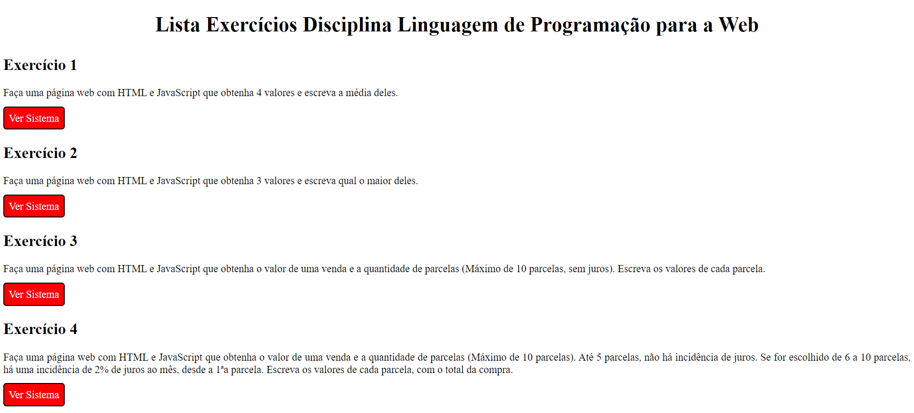
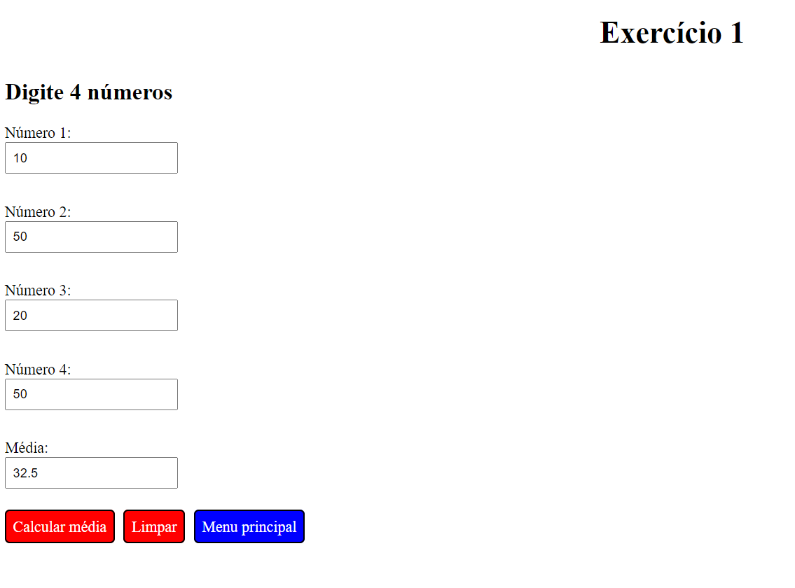
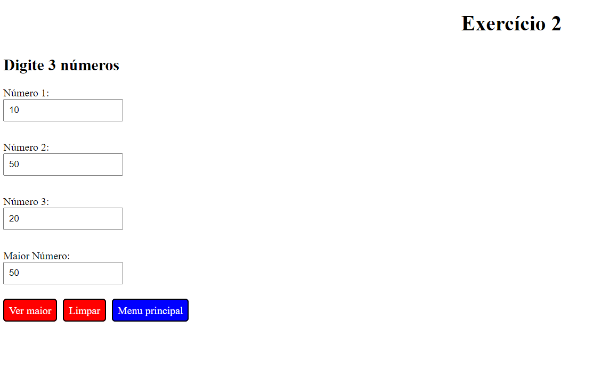
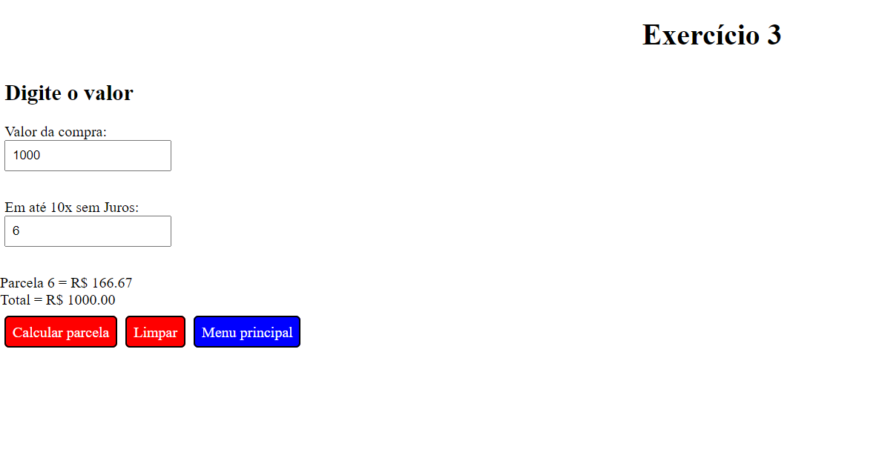
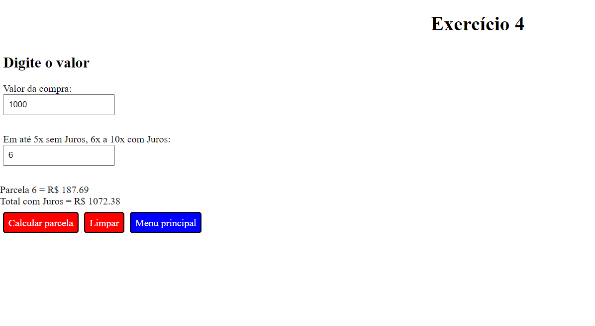

<h1 align="center">Lista Exercícios Disciplina Linguagem de Programação para a Web</h1>

Programa desenvolvido em uma atividade durante o curso de Sistemas de Informação (UFSM/FW), na matéria de Linguagem de Programação para a Web e adaptado utilizando conceitos importantes de HTML, CSS e JavaScript. 

  <a href="#-tecnologias">Tecnologias</a>     |    
  <a href="#-projeto">Projeto</a>     |    
  <a href="#-licença">Licença</a>

  

 

     
     
     
     
  

## 🚀 Tecnologias

Esse projeto foi desenvolvido com as seguintes tecnologias:

- HTML
- CSS
- JavaScript
- Git
- Github
- Visual Studio Code

## 💻 Projeto

O Projeto desenvolvido contêm uma página principal com a descrição de cada exercício e um botão para acessar cada sistema, sendo: 
- Exercício 1 é uma página web que recebe 4 valores e escreve a média deles. 
- Exercício 2 é uma página web que recebe 3 números e escreve qual o maior deles. 
- Exercício 3 é uma página web que recebe um valor de uma venda e a quantidade de parcelas (Máximo de 10 parcelas, sem juros). Ao final o programa exibe os valores de cada parcela, assim como o total pago. 
- Exercício 4 é uma página web que recebe um valor de uma venda e a quantidade de parcelas (Máximo de 10 parcelas). Até 5 parcelas, não há incidência de juros. Se for escolhido de 6 a 10 parcelas, há uma incidência de 2% de juros ao mês, desde a 1ªa parcela. Ao final o programa exibe os valores de cada parcela, assim como o total pago. 

- [ Visite o projeto online ](https://lipeharakawa.github.io/exercicios-html-css-js)

## ✅ Licença

Esse projeto está sob a licença MIT.

---

Feito com 🧡 por Felipe Seidi Harakawa.
